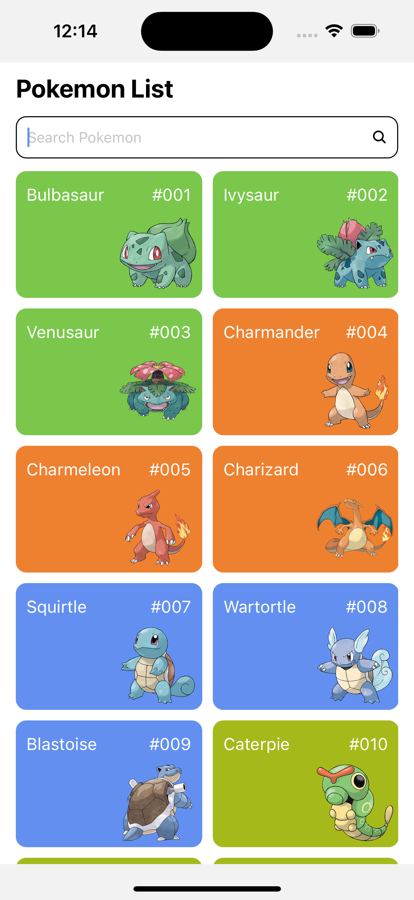
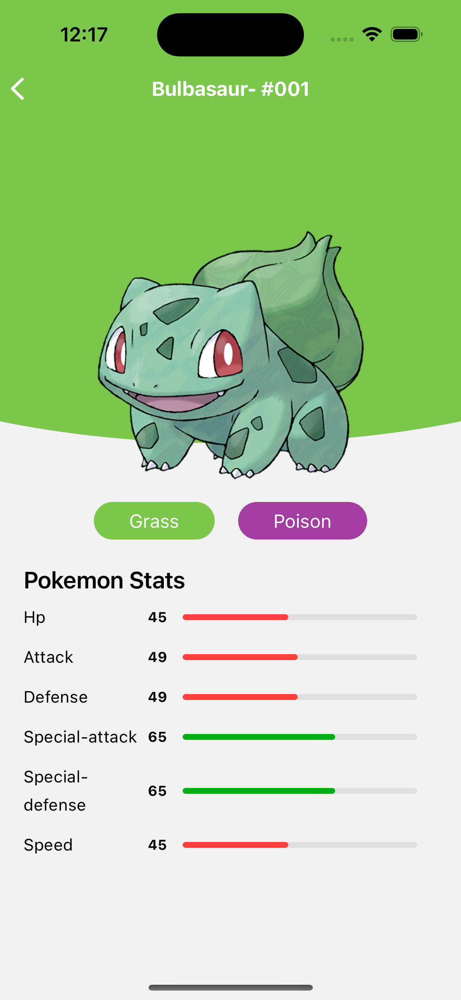

## The Challenge

To build a mobile app using React-Native and [Expo](https://expo.dev/) that lists Pokemons and some details about them.

**API Documentation:** Use the [PokeAPI](https://pokeapi.co/docs/v2) to fetch the Pokemons' data.

### Setup
Clone this repository and run these commands:

`npm install`

`npx expo start`
 
You can use [ExpoGo](https://docs.expo.dev/get-started/expo-go/) with any iOS or Android device.

### Run test

`npm run test`

Added basic test cases for checking the components render properly

### Home screen 

The home screen layout is simple and clean.
- Search bar on top
- Pokemon list rendering at the bottom

I have added background color to the card based on the pokemon type

 
     
Home Screen 

    
  

### Detail screen

Show pokemon details based on id selected

- Show the image
- Reused the type to add background color to the header
- Show various types of the pokemon
- Show basic stats as well

 

     
Detail screen

    
  

##### Note

To add search the pokemon api didn't have an clear way, the method I used is wrong but as we have a small list to search from I implemented this.

Basically I get all the pokemon available and based on the search query I filter them, while searching you will need to press the enter key so it can call the search function
